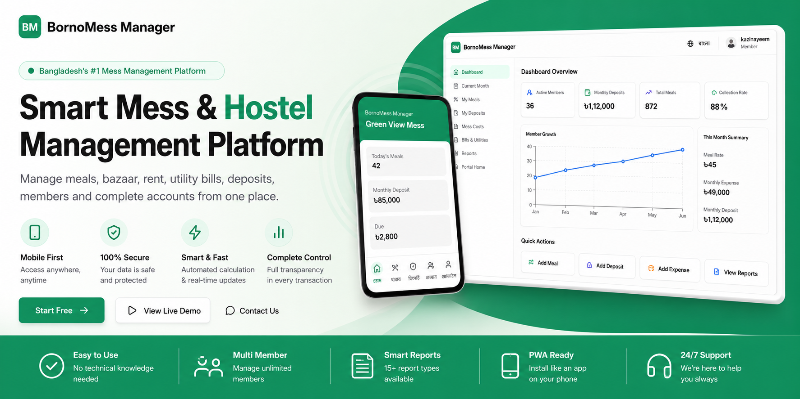

# BornoMess Manager | বর্ণোমেস ম্যানেজার

<p align="center">
  
</p>

<p align="center">
  <strong>English</strong> · <a href="#বাংলা">বাংলা</a>
</p>

<p align="center">
  A product of <a href="https://www.bornosoft.com"><strong>BornoSoft</strong></a><br/>
  <a href="https://www.bornosoft.com">www.bornosoft.com</a>
</p>

<p align="center">
  <a href="https://bornomess.vercel.app">Live Demo</a> ·
  <a href="#quick-start">Quick Start</a> ·
  <a href="docs/ARCHITECTURE.md">Architecture</a> ·
  <a href="https://github.com/kazinayeem/Manage-your-mess">GitHub</a>
</p>

---

## English

### Overview

**BornoMess Manager** is Bangladesh's smart mess, hostel, PG, and student accommodation management platform. Manage meals, bazaar, rent, utility bills, deposits, members, and complete accounts — all in one place.

Built by **BornoSoft** for mess owners, managers, and members. Full **Bangla** and **English** support.

### Why BornoMess?

| Old way | BornoMess solution |
|--------|---------------------|
| Excel sheets & manual errors | Automatic calculation |
| Lost records | Secure cloud database |
| Due tracking problems | Transparent due tracking |
| Member conflicts | Real-time shared reports |
| Desktop-only | Mobile-first PWA experience |

### How it works

1. **Create your mess** — Set up workspace with name and invite code  
2. **Add members** — Share invite link or code  
3. **Log meals & bazaar** — Daily meal and expense entry  
4. **Record deposits** — bKash, Nagad, Rocket, Upay, bank, cash  
5. **Auto calculation** — Meal rate, dues, and balances  
6. **Download reports** — PDF, Excel, CSV export  

### Features

#### Core operations
- **Meal management** — Breakfast, lunch, dinner with automatic meal-rate calculation  
- **Expense tracking** — Bazaar, utilities, categorized costs  
- **Deposit tracking** — bKash, Nagad, Rocket, Upay, bank transfer, cash  
- **Member management** — Invite codes, roles, manager-only controls  
- **Utility bills** — Electricity, gas, water, internet  
- **Rent tracking** — Monthly rent and recurring bills  

#### Bazaar assignment system
- **Task creation** — Managers assign bazaar shopping lists to members  
- **Member submissions** — Receipt upload, item costs, notes  
- **Approval workflow** — Review, approve/reject, auto-create expense entries  
- **Points & history** — Member performance tracking and audit trail  
- **Reports** — Bazaar analytics and pending-task dashboard widget  

#### Reports & PDF export
- **Professional PDF reports** — Monochrome accounting style with embedded Bangla fonts (Noto Sans Bengali)  
- **Localized exports** — Full Bangla and English column labels, summaries, and status text  
- **Print view** — Browser print layout with validation before export  
- **Spreadsheet export** — Localized CSV and Excel downloads  
- **Report types** — Monthly summary, member dues, deposits, expenses, meal logs  

#### Analytics Center (dedicated module)
Separate from the dashboard — deep business insights with lazy-loaded Recharts:

| Route | Audience |
|-------|----------|
| `/analytics` | Portal members — personal insights |
| `/member/analytics` | Member personal analytics |
| `/mess/[messId]/analytics` | Managers & owners — mess-level charts |
| `/super-admin/analytics` | Platform-wide revenue, growth, subscriptions |

**Super Admin charts:** Monthly revenue trend, subscription distribution, user growth, top messes, payment methods, conversion funnel, support tickets.

**Mess charts:** Expense/deposit trends, expense breakdown, meal consumption, member deposit/due rankings, budget vs actual, utility cost trend.

**Member charts:** Meal, deposit, monthly cost, and balance trends.

**Filters:** Today, this week/month, last 3/6 months, this year, custom range. **AI insights** highlight trends (e.g. expense spikes, overdue members). Export: PDF, Excel, CSV, print.

#### Dashboard
- **KPI cards** — Meal rate, deposits, expenses, dues  
- **Cached data** — RTK Query prevents duplicate API calls  
- **Pending bazaar widget** — Quick view of assigned tasks  

#### Property management
- **Room management** — Allocation and occupancy  
- **Bed management** — Bed assignment tracking  
- **Visitor management** — Guest logging  
- **Multi-mess support** — One account, multiple messes  
- **Branch management** — Multiple locations (Business+)  

#### Platform & admin
- **User portal** — Members view their own meals, deposits, dues  
- **Subscription billing** — Free, Pro, Business, Enterprise plans  
- **Local payments** — bKash, Nagad, Rocket payment requests  
- **Notifications** — Billing, reports, system alerts  
- **Audit logs** — Full change history  
- **Super Admin panel** — Users, messes, plans, payments, analytics  

#### Mobile & UX
- **Responsive design** — 320px to 1920px  
- **Bottom navigation** — Native app-style mobile nav with branded cover strip  
- **Floating action button** — Quick add deposit/meal/expense  
- **PWA ready** — Installable, offline-capable shell  
- **Skeleton loaders** — Premium loading states  
- **Framer Motion** — Smooth page transitions  

#### Brand assets (`public/`)
| File | Usage |
|------|--------|
| `cover.png` | Hero, auth sidebar, OG/social preview, PWA icon, mobile nav accent, footer logo |
| `1.png` – `9.png` | Landing product tour, dashboard preview tabs, how-it-works steps, mobile mock |

Screenshots appear on the landing page showcase (bottom gallery), login/register split layout, and marketing metadata.

#### Security & access
- **RBAC** — 8 roles with permission-based access  
- **Multi-tenant isolation** — Each mess data fully separated  
- **Subscription enforcement** — Read-only mode when expired  
- **Rate limiting** — Login brute-force protection  

### Tech stack

| Layer | Technology |
|-------|------------|
| **Framework** | Next.js 16 (App Router, Server Components, Streaming) |
| **UI** | React 19, TypeScript, Tailwind CSS 4 |
| **Database** | PostgreSQL (Neon) via Prisma ORM |
| **Auth** | NextAuth.js v5 (Credentials + Google OAuth) |
| **i18n** | next-intl — Bangla (default) + English |
| **Fonts** | Inter (EN), Hind Siliguri + Noto Sans Bengali (BN) |
| **Tables** | TanStack Table — search, sort, pagination, CSV export |
| **Charts** | Recharts |
| **Animation** | Framer Motion |
| **State** | Redux Toolkit + RTK Query (server data), Zustand (UI), React Context (theme & language) |
| **Forms** | React Hook Form + Zod |
| **PDF/Excel** | jsPDF, xlsx |
| **Cache** | Redis (optional, ioredis) |
| **Deploy** | Vercel + Docker |

### State management architecture

| Layer | Responsibility |
|-------|----------------|
| **Redux Toolkit + RTK Query** | Business data, API caching, mutations, background refresh |
| **Zustand** | Sidebar, modals, drawers, filters, command palette, active mess (persisted) |
| **React Context** | Theme (light/dark) and language preferences |
| **Server Actions** | Secure mutations and analytics aggregation |

RTK Query APIs: `analyticsApi`, `messApi`, `notificationApi` (extensible for auth, users, expenses, etc.)

### Architecture

```
app/[locale]/          Landing, auth, portal, analytics, mess workspace, super-admin
actions/               Server Actions (CRUD, billing, reports, bazaar, analytics)
components/            UI, analytics charts, bazaar, dashboard, mobile nav
lib/store/             Redux store, RTK Query APIs, hooks
stores/                Zustand UI state (persisted filters, sidebar, active mess)
lib/                   Auth, RBAC, billing, calculations, reports, Redis
prisma/                40+ models (bazaar, billing, mess ops), seed script
messages/              i18n (en.json, bn.json, landing.*.json)
docs/                  Architecture & deployment
```

### Quick start

**Prerequisites:** Node.js 20+, npm, PostgreSQL (or Neon)

```bash
git clone https://github.com/kazinayeem/Manage-your-mess.git
cd Manage-your-mess
npm install
cp .env.example .env
# Edit .env — set DATABASE_URL, DIRECT_URL, AUTH_SECRET, AUTH_URL
npm run db:push
npm run db:seed
npm run dev
```

Open [http://localhost:3000](http://localhost:3000) — default language is **বাংলা**.

### Demo accounts

| Role | Email | Password |
|------|-------|----------|
| Super Admin | admin@messflow.pro | Admin@123456 |
| Demo Owner | demo@messflow.pro | Demo@123456 |

### Scripts

| Command | Description |
|---------|-------------|
| `npm run dev` | Development server |
| `npm run build` | Production build |
| `npm run vercel-build` | Vercel build (Prisma + Next.js) |
| `npm run db:push` | Push schema to database |
| `npm run db:seed` | Seed plans, admin, demo data |
| `npm run db:studio` | Open Prisma Studio |
| `npm run db:reset-password` | Reset a user password (see `scripts/reset-password.ts`) |

### Deploy on Vercel

1. Push schema to Neon once: `npx prisma db push && npm run db:seed`  
2. Connect GitHub repo on Vercel  
3. Set environment variables:

| Variable | Example |
|----------|---------|
| `DATABASE_URL` | Neon pooler URL |
| `DIRECT_URL` | Neon direct URL |
| `AUTH_SECRET` | `openssl rand -base64 32` |
| `AUTH_URL` | `https://bornomess.vercel.app` |
| `NEXT_PUBLIC_APP_URL` | `https://bornomess.vercel.app` |

4. Build command: `npm run vercel-build`

### Plans

| Plan | Best for |
|------|----------|
| **Free** | Small mess, basic tracking |
| **Pro** | Growing mess, PDF/Excel reports |
| **Business** | Multiple branches, advanced analytics |
| **Enterprise** | Large hostels, custom limits |

### FAQ

- **Mobile support?** Yes — fully responsive + PWA installable  
- **PDF reports?** Yes — PDF, Excel, CSV  
- **bKash payment?** Yes — bKash, Nagad, Rocket, Upay  
- **Data safe?** Encrypted connections, multi-tenant isolation  
- **Bangla interface?** Full Bangla UI and reports  

---

## বাংলা

<a id="বাংলা"></a>

### সংক্ষিপ্ত বিবরণ

**বর্ণোমেস ম্যানেজার (BornoMess Manager)** — বাংলাদেশের স্মার্ট মেস, হোস্টেল, পিজি ও ছাত্র আবাসন ব্যবস্থাপনা প্ল্যাটফর্ম। **বর্ণোসফট (BornoSoft)**-এর একটি পণ্য।

মিল, বাজার, ভাড়া, বিদ্যুৎ বিল, ডিপোজিট, সদস্য ও সম্পূর্ণ হিসাব **এক জায়গা** থেকে পরিচালনা করুন। সম্পূর্ণ **বাংলা** ও **ইংরেজি** সমর্থন।

🌐 [www.bornosoft.com](https://www.bornosoft.com)

### কেন বর্ণোমেস?

| পুরনো পদ্ধতি | বর্ণোমেস সমাধান |
|-------------|----------------|
| এক্সেল শিট ও ভুল | স্বয়ংক্রিয় হিসাব |
| হারানো রেকর্ড | নিরাপদ ক্লাউড ডাটাবেস |
| বকেয়া ট্র্যাকিং সমস্যা | স্বচ্ছ বকেয়া ব্যবস্থাপনা |
| সদস্যদের মধ্যে বিবাদ | রিয়েল-টাইম রিপোর্ট |
| শুধু ডেস্কটপ | মোবাইল-ফার্স্ট অ্যাপ অভিজ্ঞতা |

### কিভাবে কাজ করে

১. **মেস তৈরি করুন** — নাম ও আমন্ত্রণ কোড দিয়ে ওয়ার্কস্পেস সেটআপ  
২. **সদস্য যুক্ত করুন** — আমন্ত্রণ লিংক বা কোড শেয়ার করুন  
৩. **মিল ও বাজার যুক্ত করুন** — দৈনিক মিল ও খরচ এন্ট্রি  
৪. **ডিপোজিট রেকর্ড করুন** — বিকাশ, নগদ, রকেট, উপায়, ব্যাংক  
৫. **অটো হিসাব** — মিল রেট, বকেয়া ও ব্যালেন্স  
৬. **রিপোর্ট ডাউনলোড** — PDF, Excel, CSV এক্সপোর্ট  

### বৈশিষ্ট্যসমূহ

#### মূল কার্যক্রম
- **মিল ব্যবস্থাপনা** — সকাল, দুপুর, রাতের মিল ও স্বয়ংক্রিয় মিল রেট  
- **খরচ ট্র্যাকিং** — বাজার, ইউটিলিটি, শ্রেণিবদ্ধ খরচ  
- **জমা ট্র্যাকিং** — bKash, Nagad, Rocket, Upay, ব্যাংক, নগদ  
- **সদস্য ব্যবস্থাপনা** — আমন্ত্রণ কোড, রোল, ম্যানেজার কন্ট্রোল  
- **ইউটিলিটি বিল** — বিদ্যুৎ, গ্যাস, পানি, ইন্টারনেট  
- **ভাড়া ট্র্যাকিং** — মাসিক ভাড়া ও পুনরাবৃত্ত বিল  

#### বাজার অ্যাসাইনমেন্ট সিস্টেম
- **টাস্ক তৈরি** — ম্যানেজার সদস্যদের বাজার তালিকা দেয়  
- **সদস্য জমা** — রসিদ আপলোড, আইটেম খরচ, নোট  
- **অনুমোদন** — রিভিউ, অনুমোদন/প্রত্যাখ্যান, স্বয়ংক্রিয় খরচ এন্ট্রি  
- **পয়েন্ট ও ইতিহাস** — সদস্য পারফরম্যান্স ও অডিট ট্রেইল  
- **রিপোর্ট** — বাজার অ্যানালিটিক্স ও ড্যাশবোর্ড উইজেট  

#### রিপোর্ট ও PDF এক্সপোর্ট
- **প্রফেশনাল PDF** — মনোক্রোম হিসাব শৈলী, এমবেডেড বাংলা ফন্ট (Noto Sans Bengali)  
- **স্থানীয়করণ** — সম্পূর্ণ বাংলা/ইংরেজি কলাম, সারাংশ, স্ট্যাটাস  
- **প্রিন্ট ভিউ** — ব্রাউজার প্রিন্ট লেআউট ও ভ্যালিডেশন  
- **স্প্রেডশিট** — CSV ও Excel ডাউনলোড  
- **রিপোর্ট ধরন** — মাসিক সারাংশ, বকেয়া, জমা, খরচ, মিল লগ  

#### অ্যানালিটিক্স সেন্টার (আলাদা মডিউল)
ড্যাশবোর্ড নয় — গভীর ব্যবসায়িক অন্তর্দৃষ্টি, lazy-loaded Recharts:

| রুট | দর্শক |
|-----|-------|
| `/analytics` | পোর্টাল সদস্য — ব্যক্তিগত |
| `/member/analytics` | সদস্যের ব্যক্তিগত অ্যানালিটিক্স |
| `/mess/[messId]/analytics` | ম্যানেজার ও মালিক — মেস-লেভেল |
| `/super-admin/analytics` | প্ল্যাটফর্ম-ব্যাপী রাজস্ব, প্রবৃদ্ধি |

**সুপার অ্যাডমিন:** মাসিক রাজস্ব, সাবস্ক্রিপশন বিতরণ, ইউজার প্রবৃদ্ধি, শীর্ষ মেস, পেমেন্ট পদ্ধতি, কনভার্শন ফানেল, সাপোর্ট টিকেট।

**মেস:** খরচ/জমা প্রবণতা, খরচ ভাঙ্গন, মিল খরচ, সদস্য র‍্যাঙ্কিং, বাজেট বনাম প্রকৃত, ইউটিলিটি ট্রেন্ড।

**সদস্য:** মিল, জমা, মাসিক খরচ, ব্যালেন্স ট্রেন্ড। ফিল্টার, AI অন্তর্দৃষ্টি, PDF/Excel/CSV/প্রিন্ট এক্সপোর্ট।

#### ড্যাশবোর্ড
- **KPI কার্ড** — মিল রেট, জমা, খরচ, বকেয়া  
- **ক্যাশড ডাটা** — RTK Query দ্বারা ডুপ্লিকেট API কল প্রতিরোধ  
- **বাজার উইজেট** — অ্যাসাইন করা টাস্কের দ্রুত দৃশ্য  

#### সম্পত্তি ব্যবস্থাপনা
- **রুম ব্যবস্থাপনা** — বরাদ্দ ও দখল  
- **বিছানা ব্যবস্থাপনা** — বিছানা বরাদ্দ ট্র্যাকিং  
- **ভিজিটর ব্যবস্থাপনা** — অতিথি লগ  
- **মাল্টি-মেস** — এক অ্যাকাউন্টে একাধিক মেস  
- **ব্রাঞ্চ** — একাধিক শাখা (বিজনেস+)  

#### প্ল্যাটফর্ম ও অ্যাডমিন
- **সদস্য পোর্টাল** — নিজের মিল, জমা, বকেয়া দেখুন  
- **সাবস্ক্রিপশন** — ফ্রি, প্রো, বিজনেস, এন্টারপ্রাইজ  
- **লোকাল পেমেন্ট** — বিকাশ, নগদ, রকেট পেমেন্ট রিকোয়েস্ট  
- **নোটিফিকেশন** — বিল, রিপোর্ট, সিস্টেম সতর্কতা  
- **অডিট লগ** — সম্পূর্ণ পরিবর্তনের ইতিহাস  
- **সুপার অ্যাডমিন** — ইউজার, মেস, প্ল্যান, পেমেন্ট, অ্যানালিটিক্স  

#### মোবাইল ও UX
- **রেসপন্সিভ** — ৩২০px থেকে ১৯২০px  
- **বটম নেভিগেশন** — নেটিভ অ্যাপ স্টাইল + ব্র্যান্ডেড কভার স্ট্রিপ  
- **ফ্লোটিং বাটন** — দ্রুত জমা/মিল/খরচ যোগ  
- **PWA** — ইনস্টলযোগ্য, অফলাইন সাপোর্ট  
- **স্কেলেটন লোডার** — প্রিমিয়াম লোডিং  
- **অ্যানিমেশন** — Framer Motion ট্রানজিশন  

#### ব্র্যান্ড অ্যাসেট (`public/`)
| ফাইল | ব্যবহার |
|------|---------|
| `cover.png` | হিরো, অথ সাইডবার, OG প্রিভিউ, PWA আইকন, মোবাইল নেভ অ্যাকসেন্ট |
| `1.png` – `9.png` | ল্যান্ডিং ট্যুর, ড্যাশবোর্ড প্রিভিউ, ধাপে ধাপে গাইড, মোবাইল মক |

#### নিরাপত্তা
- **RBAC** — ৮টি রোল, পারমিশন ভিত্তিক অ্যাক্সেস  
- **মাল্টি-টেন্যান্ট** — প্রতিটি মেসের ডাটা আলাদা  
- **সাবস্ক্রিপশন নিয়ন্ত্রণ** — মেয়াদ শেষে শুধু দেখার মোড  
- **রেট লিমিটিং** — লগইন সুরক্ষা  

### টেক স্ট্যাক

| স্তর | প্রযুক্তি |
|-----|----------|
| **ফ্রেমওয়ার্ক** | Next.js 16 (App Router, Server Components) |
| **UI** | React 19, TypeScript, Tailwind CSS 4 |
| **ডাটাবেস** | PostgreSQL (Neon) + Prisma ORM |
| **অথেন্টিকেশন** | NextAuth.js v5 |
| **ভাষা** | next-intl — বাংলা (ডিফল্ট) + ইংরেজি |
| **ফন্ট** | Inter (EN), Hind Siliguri + Noto Sans Bengali (BN) |
| **টেবিল** | TanStack Table |
| **চার্ট** | Recharts |
| **অ্যানিমেশন** | Framer Motion |
| **স্টেট** | Redux Toolkit + RTK Query (সার্ভার ডাটা), Zustand (UI), React Context (থিম ও ভাষা) |
| **PDF/Excel** | jsPDF, xlsx |
| **ক্যাশ** | Redis (ঐচ্ছিক) |
| **ডিপ্লয়** | Vercel + Docker |

### স্টেট ম্যানেজমেন্ট

| স্তর | দায়িত্ব |
|-----|---------|
| **Redux Toolkit + RTK Query** | ব্যবসায়িক ডাটা, API ক্যাশিং, মিউটেশন |
| **Zustand** | সাইডবার, মোডাল, ফিল্টার, সক্রিয় মেস (persisted) |
| **React Context** | থিম (লাইট/ডার্ক) ও ভাষা |
| **Server Actions** | নিরাপদ মিউটেশন ও অ্যানালিটিক্স অ্যাগ্রিগেশন |

### দ্রুত শুরু

```bash
git clone https://github.com/kazinayeem/Manage-your-mess.git
cd Manage-your-mess
npm install
cp .env.example .env
npm run db:push
npm run db:seed
npm run dev
```

[http://localhost:3000](http://localhost:3000) খুলুন — ডিফল্ট ভাষা **বাংলা**।

### ডেমো অ্যাকাউন্ট

| ভূমিকা | ইমেইল | পাসওয়ার্ড |
|--------|-------|-----------|
| সুপার অ্যাডমিন | admin@messflow.pro | Admin@123456 |
| ডেমো মালিক | demo@messflow.pro | Demo@123456 |

### ভেরসেলে ডিপ্লয়

| ভেরিয়েবল | মান |
|----------|-----|
| `DATABASE_URL` | Neon pooler URL |
| `DIRECT_URL` | Neon direct URL |
| `AUTH_SECRET` | গোপন কী |
| `AUTH_URL` | `https://bornomess.vercel.app` |
| `NEXT_PUBLIC_APP_URL` | `https://bornomess.vercel.app` |

বিল্ড কমান্ড: `npm run vercel-build`

### প্ল্যান

| প্ল্যান | উপযুক্ত |
|--------|---------|
| **ফ্রি** | ছোট মেস, মৌলিক ট্র্যাকিং |
| **প্রো** | বড় মেস, PDF/Excel রিপোর্ট |
| **বিজনেস** | একাধিক শাখা, অ্যাডভান্সড অ্যানালিটিক্স |
| **এন্টারপ্রাইজ** | বড় হোস্টেল, কাস্টম লিমিট |

### প্রশ্নোত্তর

- **মোবাইলে ব্যবহার?** হ্যাঁ — সম্পূর্ণ রেসপন্সিভ + PWA  
- **PDF রিপোর্ট?** হ্যাঁ — PDF, Excel, CSV  
- **বিকাশে পেমেন্ট?** হ্যাঁ — bKash, Nagad, Rocket, Upay  
- **ডাটা সেফ?** এনক্রিপ্টেড, মাল্টি-টেন্যান্ট আইসোলেশন  
- **বাংলা ইন্টারফেস?** সম্পূর্ণ বাংলা UI ও রিপোর্ট  

---

## Links | লিংক

| | |
|---|---|
| **Live** | [bornomess.vercel.app](https://bornomess.vercel.app) |
| **BornoSoft** | [www.bornosoft.com](https://www.bornosoft.com) |
| **GitHub** | [github.com/kazinayeem/Manage-your-mess](https://github.com/kazinayeem/Manage-your-mess) |
| **Docs** | [docs/ARCHITECTURE.md](docs/ARCHITECTURE.md) |

## License

Proprietary — **BornoMess Manager**, a product of **BornoSoft**.

© BornoSoft. All rights reserved.
