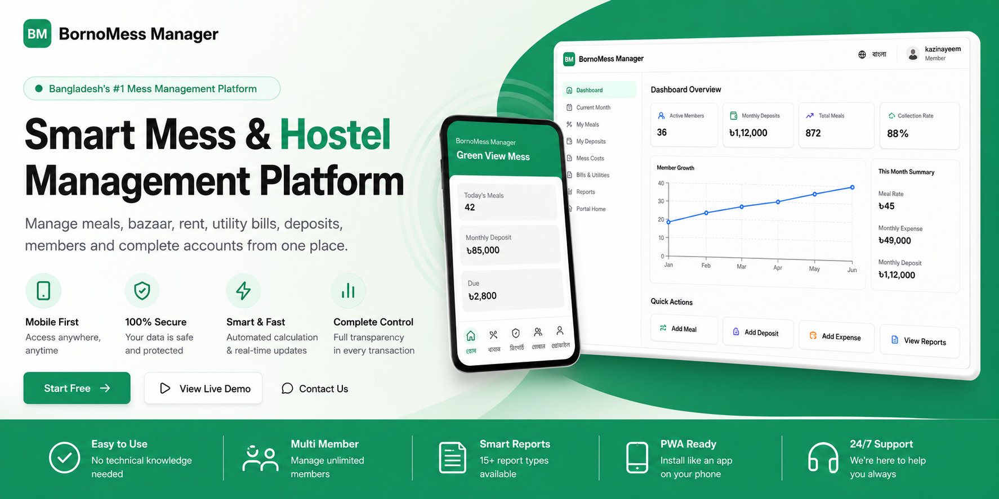

# BornoMess Manager | বর্ণোমেস ম্যানেজার

<p align="center">
  
</p>

<p align="center">
  <strong>English</strong> · <a href="#বাংলা">বাংলা</a>
</p>

<p align="center">
  A product of <a href="https://www.bornosoft.com"><strong>BornoSoft</strong></a><br/>
  <a href="https://www.bornosoft.com">www.bornosoft.com</a>
</p>

<p align="center">
  <a href="https://bornomess.vercel.app">Live Demo</a> ·
  <a href="#quick-start">Quick Start</a> ·
  <a href="#architecture">Architecture</a> ·
  <a href="https://github.com/kazinayeem/Manage-your-mess">GitHub</a>
</p>

---

## English

### Overview

**BornoMess Manager** is Bangladesh's smart mess, hostel, PG, and student accommodation management platform. Manage meals, bazaar, rent, utility bills, deposits, members, and complete accounts — all in one place.

Built by **BornoSoft** for mess owners, managers, and members. Full **Bangla** and **English** support.

### Why BornoMess?

| Old way | BornoMess solution |
|--------|---------------------|
| Excel sheets & manual errors | Automatic calculation |
| Lost records | Secure database |
| Due tracking problems | Transparent due tracking |
| Member conflicts | Real-time shared reports |
| Desktop-only | Mobile-first PWA + Flutter app |

---

### Architecture

This is a **monorepo** with three independently runnable applications sharing a single Express API backend.

```
Manage-your-mess/
├── backend/    # Express.js + Prisma ORM + SQLite  →  http://localhost:5000
├── frontend/   # Next.js 16 Web App               →  http://localhost:3000
├── mobile/     # Flutter Mobile App               →  connects to :5000
└── docs/       # Architecture & deployment docs
```

#### Data flow

```
Next.js (port 3000)          Flutter (mobile)
       │                            │
       │ RTK Query / Server Actions │ Dio HTTP client
       │     credentials: include   │   Authorization: Bearer
       └──────────────┬─────────────┘
                      ▼
           Express.js API (port 5000)
                      │
               Prisma ORM
                      │
              SQLite (dev.db)
```

> **Express is the only backend.** Next.js contains zero API routes, zero database imports, and zero Prisma usage. All data access is done by calling the Express REST API.

#### Authentication flow

```
1. POST /api/v1/auth/login  (credentials → Express)
        ↓
2. Express verifies password, issues JWT
        ↓
3. Express sets httpOnly cookies:
     bornomess.session  (access token, 15 min)
     bornomess.refresh  (refresh token, 30 days)
        ↓
4. Browser/Flutter sends token on subsequent requests
   (browser: automatic via credentials:include cookie)
   (Flutter: Authorization: Bearer <token> header)
        ↓
5. GET /api/v1/auth/me  →  returns current user profile
```

**Next.js middleware** reads `bornomess.session` directly from the request cookie, decodes the JWT payload, and performs role-based route guards — no NextAuth involved.

**RTK Query** (web) uses `credentials: "include"` so the browser automatically attaches the httpOnly session cookie on every API call to port 5000.

**Flutter** reads the token from the login response and sends it as `Authorization: Bearer <token>` via Dio.

> ⚠️ **Known issue — `/auth/me` returns "Authentication token missing"**
>
> If the browser or Flutter client receives `{ "message": "Authentication token missing" }` from `GET /api/v1/auth/me`, the most common causes are:
>
> - Cross-origin cookie blocked — the cookie domain/path does not match the request origin
> - Access token expired (15-minute TTL); call `POST /api/v1/auth/refresh` to rotate the token
> - Flutter: the `Authorization: Bearer` header is missing — verify `env.dart` resolves the correct host (`10.0.2.2:5000` on Android emulator, `127.0.0.1:5000` on iOS)
> - CORS: the backend `FRONTEND_URL` env var must exactly match the Next.js origin (`http://localhost:3000`)
>
> This issue has **not** been patched in application code as of this writing. See the Troubleshooting section below for diagnosis steps.

---

### Tech Stack

| Layer | Technology |
|-------|------------|
| **Backend** | Express.js, TypeScript, Node.js 20+ |
| **ORM** | Prisma ORM |
| **Database** | SQLite (`backend/prisma/dev.db`) |
| **Auth** | Custom JWT — `bornomess.session` httpOnly cookie |
| **Web Framework** | Next.js 16 (App Router, Server Components) |
| **Web UI** | React 19, TypeScript, Tailwind CSS 4 |
| **Web State** | Redux Toolkit + RTK Query (API data), Zustand (UI state) |
| **Web API calls** | RTK Query with `credentials: "include"` → Express :5000 |
| **Server Actions** | Read `bornomess.session` cookie → forward Bearer token to Express |
| **Mobile** | Flutter (Dart) |
| **Mobile HTTP** | Dio → `Authorization: Bearer <token>` → Express :5000 |
| **i18n** | next-intl — Bangla (default) + English |
| **Charts** | Recharts |
| **Animation** | Framer Motion |
| **PDF/Excel** | jsPDF, xlsx |
| **Cache** | Redis (optional, falls back to in-memory) |

---

### Quick Start

**Prerequisites:** Node.js 20+, npm 10+, Flutter SDK (for mobile)

```bash
git clone https://github.com/kazinayeem/Manage-your-mess.git
cd Manage-your-mess

# Full setup: install deps, build backend, copy Prisma types, push schema, seed DB
npm run setup
```

Then start the development servers:

```bash
# Start both Express (5000) and Next.js (3000) concurrently
npm run dev

# Or start individually
npm run dev:backend    # Express → http://localhost:5000
npm run dev:frontend   # Next.js → http://localhost:3000
npm run dev:mobile     # Flutter  (requires emulator or device)
```

Open [http://localhost:3000](http://localhost:3000) — default language is **বাংলা**.

---

### Root Commands Reference

| Command | Description |
|---------|-------------|
| `npm run setup` | Install all deps, build backend, copy Prisma client types to frontend, push DB schema, seed data |
| `npm run dev` | Start Express (5000) + Next.js (3000) concurrently |
| `npm run dev:backend` | Start Express backend only |
| `npm run dev:frontend` | Start Next.js frontend only |
| `npm run dev:mobile` | Run Flutter app (`flutter run`) |
| `npm run build` | Production build — backend then frontend |
| `npm run build:backend` | Build Express TypeScript |
| `npm run build:frontend` | Next.js production build |
| `npm run lint` | Lint backend + frontend |
| `npm run test` | Run backend + frontend + mobile tests |
| `npm run db:push` | Push Prisma schema to SQLite (no migration file) |
| `npm run db:seed` | Seed database with plans, admin, and demo accounts |
| `npm run db:generate` | Regenerate Prisma client types |

> **Database commands** run inside `backend/`. The SQLite file is at `backend/prisma/dev.db`.

---

### Environment Variables

#### Backend (`backend/.env`)

Copy `backend/.env.example` and fill in:

| Variable | Default | Description |
|----------|---------|-------------|
| `PORT` | `5000` | Express server port |
| `NODE_ENV` | `development` | `development` or `production` |
| `DATABASE_URL` | `file:./dev.db` | SQLite file path |
| `FRONTEND_URL` | `http://localhost:3000` | Allowed CORS origin (must match exactly) |
| `JWT_SECRET` | *(required)* | Long random secret for signing JWTs |
| `JWT_EXPIRES_IN` | `15m` | Access token lifetime |
| `JWT_REFRESH_EXPIRES_IN` | `30d` | Refresh token lifetime |
| `BCRYPT_ROUNDS` | `12` | Password hashing cost |
| `REDIS_URL` | *(optional)* | Redis for rate limiting; falls back to memory |
| `STORAGE_ROOT` | `./storage/uploads` | File upload directory |

#### Frontend (`frontend/.env.local`)

| Variable | Default | Description |
|----------|---------|-------------|
| `NEXT_PUBLIC_API_URL` | `http://localhost:5000` | Express backend base URL |

#### Flutter (`mobile/`)

The API URL is resolved automatically in `lib/app/config/env.dart`:
- Android emulator → `http://10.0.2.2:5000`
- iOS simulator / desktop → `http://127.0.0.1:5000`
- Override at build time: `--dart-define=API_URL=http://your-server:5000`

---

### Demo Accounts (Quick Login)

These accounts are seeded by `npm run db:seed`:

| Role | Email | Password | Access |
|------|-------|----------|--------|
| **Super Admin** | `admin@messflow.pro` | `Admin@123456` | Full platform — users, messes, plans, payments, analytics, audit logs |
| **Demo Owner** | `demo@messflow.pro` | `Demo@123456` | Demo mess — dashboard, members, meals, deposits, reports |

**Web:** The login page includes **Quick Login** buttons in development mode. Click "Super Admin" or "Demo Owner" to submit credentials automatically without typing.

**Flutter:** The login screen includes the same Quick Login buttons in debug builds. Tap "Super Admin" or "Demo Owner" to log in instantly.

---

### Features

#### Core operations
- **Meal management** — Breakfast, lunch, dinner with automatic meal-rate calculation
- **Expense tracking** — Bazaar, utilities, categorized costs
- **Deposit tracking** — bKash, Nagad, Rocket, Upay, bank transfer, cash
- **Member management** — Invite codes, roles, manager-only controls
- **Utility bills** — Electricity, gas, water, internet
- **Rent tracking** — Monthly rent and recurring bills

#### Bazaar assignment system
- **Task creation** — Managers assign bazaar shopping lists to members
- **Member submissions** — Receipt upload, item costs, notes
- **Approval workflow** — Review, approve/reject, auto-create expense entries
- **Points & history** — Member performance tracking and audit trail

#### Reports & export
- **PDF reports** — Monochrome accounting style with embedded Bangla fonts (Noto Sans Bengali)
- **Localized exports** — Full Bangla and English labels, summaries, status text
- **Spreadsheet export** — CSV and Excel downloads
- **Report types** — Monthly summary, member dues, deposits, expenses, meal logs

#### Analytics Center
Separate from the dashboard — deep business insights with Recharts:

| Route | Audience |
|-------|----------|
| `/analytics` | Portal members — personal insights |
| `/member/analytics` | Member personal analytics |
| `/mess/[messId]/analytics` | Managers & owners — mess-level charts |
| `/super-admin/analytics` | Platform-wide revenue, growth, subscriptions |

Filters: today, this week/month, last 3/6 months, this year, custom range. Export: PDF, Excel, CSV, print.

#### Super Admin panel (`/super-admin`)

The Super Admin role has full platform oversight:

| Section | Capabilities |
|---------|-------------|
| **Messes** | View, approve, suspend, and delete messes |
| **Users** | List all users, view profiles, manage roles, deactivate accounts |
| **Subscriptions** | View all active/expired subscriptions, upgrade/downgrade plans |
| **Payments** | View payment history, payment methods, manual payment approval |
| **Plans** | Create and edit subscription plans (Free, Pro, Business, Enterprise) |
| **Analytics** | Platform-wide revenue trend, subscription distribution, user growth, top messes, conversion funnel |
| **Reports** | Cross-mess financial summaries, export platform data |
| **Audit Logs** | Full immutable change history across all messes and users |
| **Support** | View and respond to support tickets |
| **Announcements** | Broadcast platform-wide notices |
| **Feature Flags** | Enable/disable features per plan or globally |
| **Security** | Rate limit config, IP block, session management |

#### Security & access
- **RBAC** — 8 roles with permission-based access
- **Multi-tenant isolation** — Each mess's data fully separated
- **Subscription enforcement** — Read-only mode when plan expired
- **Rate limiting** — Login brute-force protection
- **httpOnly cookies** — Session tokens are never accessible via JavaScript

---

### State Management (Web)

| Layer | Responsibility |
|-------|----------------|
| **Redux Toolkit + RTK Query** | Business data fetching, API caching, mutations, background refresh — all calls go to Express :5000 |
| **Zustand** | Sidebar, modals, drawers, filters, active mess selection (persisted) |
| **React Context** | Theme (light/dark) and language preferences |
| **Next.js Server Actions** | Secure server-side operations — reads `bornomess.session` cookie and forwards Bearer token to Express |

---

### Troubleshooting

#### `/api/v1/auth/me` returns `Authentication token missing`

This means the request reached Express without a valid session cookie or Authorization header.

**For web (Next.js → Express):**
1. Confirm the Express `FRONTEND_URL` env var equals `http://localhost:3000` exactly (no trailing slash)
2. Confirm RTK Query `baseApi` uses `credentials: "include"`
3. Check browser DevTools → Application → Cookies — the `bornomess.session` cookie should be present with the `HttpOnly` flag set
4. If the cookie exists but is expired (15-minute TTL), call `POST /api/v1/auth/refresh` to rotate the token

**For Flutter → Express:**
1. Verify `env.dart` resolves the correct host for your target platform
2. Ensure the Dio request includes `Authorization: Bearer <token>` in headers
3. Android emulator uses `10.0.2.2` — `localhost` will not reach the host machine
4. On a real device, use your machine's LAN IP instead of `127.0.0.1`

**General diagnosis:**
```bash
# Confirm backend is running and healthy
curl http://localhost:5000/health

# Test login — observe the Set-Cookie response headers
curl -c cookies.txt -X POST http://localhost:5000/api/v1/auth/login \
  -H "Content-Type: application/json" \
  -d '{"email":"admin@messflow.pro","password":"Admin@123456"}'

# Test /auth/me using the saved cookie
curl -b cookies.txt http://localhost:5000/api/v1/auth/me
```

---

### Plans

| Plan | Best for |
|------|----------|
| **Free** | Small mess, basic tracking |
| **Pro** | Growing mess, PDF/Excel reports |
| **Business** | Multiple branches, advanced analytics |
| **Enterprise** | Large hostels, custom limits |

### FAQ

- **Mobile app?** Yes — Flutter app connects to the same Express backend
- **PDF reports?** Yes — PDF, Excel, CSV
- **bKash payment?** Yes — bKash, Nagad, Rocket, Upay
- **Data safe?** httpOnly cookies, RBAC, multi-tenant isolation
- **Bangla interface?** Full Bangla UI and reports

---

## বাংলা

<a id="বাংলা"></a>

### সংক্ষিপ্ত বিবরণ

**বর্ণোমেস ম্যানেজার (BornoMess Manager)** — বাংলাদেশের স্মার্ট মেস, হোস্টেল, পিজি ও ছাত্র আবাসন ব্যবস্থাপনা প্ল্যাটফর্ম। **বর্ণোসফট (BornoSoft)**-এর একটি পণ্য।

মিল, বাজার, ভাড়া, বিদ্যুৎ বিল, ডিপোজিট, সদস্য ও সম্পূর্ণ হিসাব **এক জায়গা** থেকে পরিচালনা করুন। সম্পূর্ণ **বাংলা** ও **ইংরেজি** সমর্থন।

🌐 [www.bornosoft.com](https://www.bornosoft.com)

### আর্কিটেকচার

```
backend/    # Express.js + Prisma + SQLite  →  http://localhost:5000
frontend/   # Next.js 16                   →  http://localhost:3000
mobile/     # Flutter                      →  Express :5000 এ সংযুক্ত
```

> **Express-ই একমাত্র ব্যাকএন্ড।** Next.js-এ কোনো API route নেই, কোনো ডাটাবেস সংযোগ নেই। সব ডাটা Express REST API-এর মাধ্যমে আসে।

### দ্রুত শুরু

```bash
git clone https://github.com/kazinayeem/Manage-your-mess.git
cd Manage-your-mess
npm run setup
npm run dev
```

[http://localhost:3000](http://localhost:3000) খুলুন — ডিফল্ট ভাষা **বাংলা**।

### কমান্ড রেফারেন্স

| কমান্ড | বিবরণ |
|--------|-------|
| `npm run setup` | সম্পূর্ণ সেটআপ — install, build, DB push, seed |
| `npm run dev` | Express (5000) + Next.js (3000) একসাথে চালু |
| `npm run dev:backend` | শুধু Express |
| `npm run dev:frontend` | শুধু Next.js |
| `npm run dev:mobile` | Flutter অ্যাপ চালু |
| `npm run db:push` | Prisma স্কিমা SQLite-এ push |
| `npm run db:seed` | ডেমো ডাটা ও অ্যাডমিন অ্যাকাউন্ট তৈরি |
| `npm run db:generate` | Prisma Client পুনরায় generate |

### ডেমো অ্যাকাউন্ট

| ভূমিকা | ইমেইল | পাসওয়ার্ড |
|--------|-------|-----------|
| সুপার অ্যাডমিন | admin@messflow.pro | Admin@123456 |
| ডেমো মালিক | demo@messflow.pro | Demo@123456 |

ওয়েব ও Flutter-এর লগইন পেজে **Quick Login বাটন** আছে (development মোডে) — এক ক্লিকেই লগইন।

### কেন বর্ণোমেস?

| পুরনো পদ্ধতি | বর্ণোমেস সমাধান |
|-------------|----------------|
| এক্সেল শিট ও ভুল | স্বয়ংক্রিয় হিসাব |
| হারানো রেকর্ড | নিরাপদ ডাটাবেস |
| বকেয়া ট্র্যাকিং সমস্যা | স্বচ্ছ বকেয়া ব্যবস্থাপনা |
| সদস্যদের মধ্যে বিবাদ | রিয়েল-টাইম রিপোর্ট |
| শুধু ডেস্কটপ | মোবাইল-ফার্স্ট PWA + Flutter অ্যাপ |

### বৈশিষ্ট্যসমূহ

#### মূল কার্যক্রম
- **মিল ব্যবস্থাপনা** — সকাল, দুপুর, রাতের মিল ও স্বয়ংক্রিয় মিল রেট
- **খরচ ট্র্যাকিং** — বাজার, ইউটিলিটি, শ্রেণিবদ্ধ খরচ
- **জমা ট্র্যাকিং** — bKash, Nagad, Rocket, Upay, ব্যাংক, নগদ
- **সদস্য ব্যবস্থাপনা** — আমন্ত্রণ কোড, রোল, ম্যানেজার কন্ট্রোল
- **ইউটিলিটি বিল** — বিদ্যুৎ, গ্যাস, পানি, ইন্টারনেট
- **ভাড়া ট্র্যাকিং** — মাসিক ভাড়া ও পুনরাবৃত্ত বিল

#### সুপার অ্যাডমিন প্যানেল
- মেস অনুমোদন, সাসপেন্ড ও মুছুন
- সকল ব্যবহারকারী ব্যবস্থাপনা
- সাবস্ক্রিপশন ও পেমেন্ট পর্যবেক্ষণ
- প্ল্যাটফর্ম-ব্যাপী অ্যানালিটিক্স ও রিপোর্ট
- অডিট লগ (সম্পূর্ণ পরিবর্তনের ইতিহাস)

#### রিপোর্ট ও PDF এক্সপোর্ট
- **প্রফেশনাল PDF** — মনোক্রোম হিসাব শৈলী, এমবেডেড বাংলা ফন্ট
- **স্প্রেডশিট** — CSV ও Excel ডাউনলোড
- **রিপোর্ট ধরন** — মাসিক সারাংশ, বকেয়া, জমা, খরচ, মিল লগ

#### অ্যানালিটিক্স সেন্টার

| রুট | দর্শক |
|-----|-------|
| `/analytics` | পোর্টাল সদস্য |
| `/member/analytics` | সদস্যের ব্যক্তিগত |
| `/mess/[messId]/analytics` | ম্যানেজার ও মালিক |
| `/super-admin/analytics` | প্ল্যাটফর্ম-ব্যাপী |

#### নিরাপত্তা
- **RBAC** — ৮টি রোল, পারমিশন ভিত্তিক অ্যাক্সেস
- **মাল্টি-টেন্যান্ট** — প্রতিটি মেসের ডাটা আলাদা
- **httpOnly কুকি** — JavaScript থেকে session token অ্যাক্সেসযোগ্য নয়
- **রেট লিমিটিং** — লগইন সুরক্ষা

### টেক স্ট্যাক

| স্তর | প্রযুক্তি |
|-----|----------|
| **ব্যাকএন্ড** | Express.js, TypeScript, Node.js 20+ |
| **ডাটাবেস** | SQLite + Prisma ORM |
| **অথেন্টিকেশন** | কাস্টম JWT (httpOnly কুকি) |
| **ওয়েব** | Next.js 16, React 19, TypeScript, Tailwind CSS 4 |
| **ওয়েব স্টেট** | Redux Toolkit + RTK Query, Zustand |
| **মোবাইল** | Flutter (Dart), Dio |
| **ভাষা** | next-intl — বাংলা (ডিফল্ট) + ইংরেজি |
| **চার্ট** | Recharts |
| **অ্যানিমেশন** | Framer Motion |
| **PDF/Excel** | jsPDF, xlsx |

### প্ল্যান

| প্ল্যান | উপযুক্ত |
|--------|---------|
| **ফ্রি** | ছোট মেস, মৌলিক ট্র্যাকিং |
| **প্রো** | বড় মেস, PDF/Excel রিপোর্ট |
| **বিজনেস** | একাধিক শাখা, অ্যাডভান্সড অ্যানালিটিক্স |
| **এন্টারপ্রাইজ** | বড় হোস্টেল, কাস্টম লিমিট |

### প্রশ্নোত্তর

- **মোবাইল অ্যাপ?** হ্যাঁ — Flutter অ্যাপ একই Express ব্যাকএন্ড ব্যবহার করে
- **PDF রিপোর্ট?** হ্যাঁ — PDF, Excel, CSV
- **বিকাশে পেমেন্ট?** হ্যাঁ — bKash, Nagad, Rocket, Upay
- **ডাটা সেফ?** httpOnly কুকি, RBAC, মাল্টি-টেন্যান্ট আইসোলেশন
- **বাংলা ইন্টারফেস?** সম্পূর্ণ বাংলা UI ও রিপোর্ট

---

## Links | লিংক

| | |
|---|---|
| **Live** | [bornomess.vercel.app](https://bornomess.vercel.app) |
| **BornoSoft** | [www.bornosoft.com](https://www.bornosoft.com) |
| **GitHub** | [github.com/kazinayeem/Manage-your-mess](https://github.com/kazinayeem/Manage-your-mess) |
| **Docs** | [docs/ARCHITECTURE.md](docs/ARCHITECTURE.md) |

## License

Proprietary — **BornoMess Manager**, a product of **BornoSoft**.

© BornoSoft. All rights reserved.
