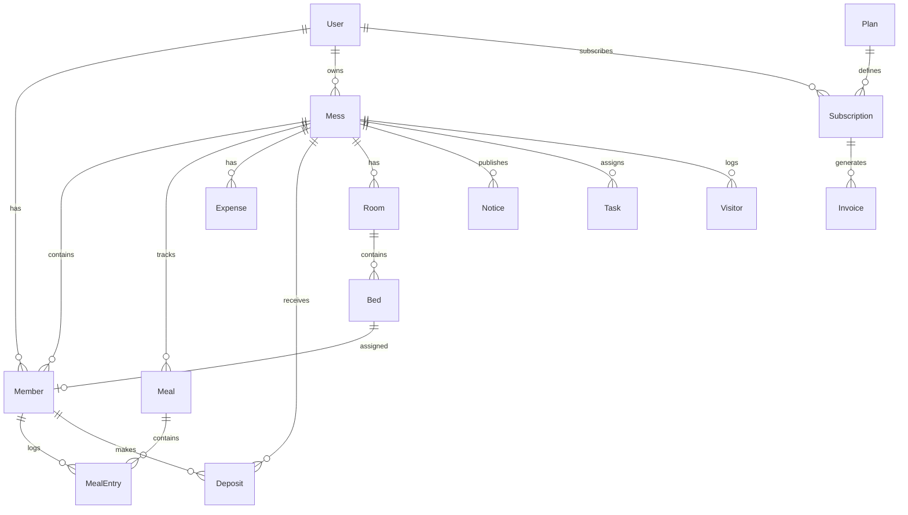

# MessFlow Pro — Enterprise SaaS Documentation

## Overview

MessFlow Pro is a multi-tenant SaaS platform for mess, hostel, PG, and student accommodation management. Built with Next.js 16, React 19, Prisma, and PostgreSQL.

## Quick Start

```bash
# Install dependencies
npm install

# Set up environment
cp .env.example .env

# Push database schema
npm run db:push

# Seed demo data
npm run db:seed

# Start development server
npm run dev
```

### Demo Credentials

| Role | Email | Password |
|------|-------|----------|
| Super Admin | admin@messflow.pro | Admin@123456 |
| Demo Owner | demo@messflow.pro | Demo@123456 |

## Architecture

```
┌─────────────────────────────────────────────────────────┐
│                    CDN / Vercel Edge                     │
├─────────────────────────────────────────────────────────┤
│  Next.js App (App Router + Server Actions + API Routes) │
├──────────┬──────────┬──────────┬────────────────────────┤
│  Auth.js │  Prisma  │  Redis   │  next-intl (en/bn)     │
├──────────┴──────────┴──────────┴────────────────────────┤
│              SQLite (dev) / PostgreSQL (prod)            │
└─────────────────────────────────────────────────────────┘
```

## Folder Structure

```
mess-manager/
├── app/
│   ├── [locale]/           # i18n routes (en, bn)
│   │   ├── page.tsx        # Landing page
│   │   ├── features/       # Marketing pages
│   │   ├── pricing/
│   │   ├── login/          # Auth pages
│   │   ├── dashboard/      # App modules
│   │   └── admin/          # Super admin panel
│   └── api/                # REST API + webhooks
├── actions/                # Server Actions
├── components/
│   ├── ui/                 # ShadCN-style components
│   ├── marketing/          # Landing page components
│   ├── dashboard/          # Dashboard components
│   └── auth/               # Auth forms
├── lib/                    # Utilities, auth, RBAC, queries
├── prisma/                 # Database schema + seed
├── messages/               # i18n translations
├── stores/                 # Zustand state
├── i18n/                   # next-intl config
└── docs/                   # Documentation
```

## Database Models

30+ models including: User, Mess, Branch, Member, Room, Bed, Meal, MealEntry, Expense, Deposit, Transaction, Notice, Task, Visitor, Notification, Report, Subscription, Plan, Invoice, Coupon, Referral, AuditLog, SupportTicket.

See `prisma/schema.prisma` for complete schema with relations, indexes, enums, and soft deletes.

## ER Diagram



## API Design

### REST Endpoints

| Method | Endpoint | Description |
|--------|----------|-------------|
| GET | `/api/v1` | Get user messes (authenticated) |
| POST | `/api/v1` | API action (API key required) |
| POST | `/api/webhooks` | Webhook receiver |
| GET/POST | `/api/auth/*` | NextAuth handlers |

### Server Actions

| Action | File | Description |
|--------|------|-------------|
| `registerUser` | `actions/mess.ts` | User registration |
| `createMess` | `actions/mess.ts` | Create new mess |
| `joinMess` | `actions/mess.ts` | Join via invite code |
| `addExpense` | `actions/mess.ts` | Add expense |
| `addDeposit` | `actions/mess.ts` | Record deposit |
| `addMealEntry` | `actions/mess.ts` | Log meals |
| `approveMember` | `actions/mess.ts` | Approve pending member |
| `approveDeposit` | `actions/mess.ts` | Approve deposit |
| `approveExpense` | `actions/mess.ts` | Approve expense |

## Authentication Flow

1. **Registration**: Email + password → bcrypt hash → OTP for email verification
2. **Login**: Credentials or Google OAuth → rate limiting → security log
3. **Session**: JWT strategy, 30-day max age
4. **Security**: Account locking after 5 failed attempts, device tracking, audit logs

## RBAC System

8 roles with permission-based access control:

- `SUPER_ADMIN` — Full platform access
- `ADMIN` — Platform administration
- `MESS_OWNER` — Full mess control
- `MESS_MANAGER` — Mess operations
- `ASSISTANT_MANAGER` — Limited management
- `ACCOUNTANT` — Financial operations
- `MEMBER` — Self-service access
- `GUEST` — Read-only notices

Permissions defined in `lib/rbac.ts`.

## Subscription Plans

| Plan | Price | Members | Key Features |
|------|-------|---------|--------------|
| Free | 0 BDT | 10 | Basic tracking, monthly report |
| Pro | 299 BDT/mo | 30 | Rooms, notices, PDF/Excel export |
| Business | 799 BDT/mo | 100 | AI analytics, branches, SMS |
| Enterprise | Custom | Unlimited | API, webhooks, custom branding |

## Financial Calculations

```
Meal Rate = Total Approved Expenses ÷ Total Meals
Member Cost = Meal Count × Meal Rate
Due Amount = Member Cost - Total Deposits
```

Auto-recalculated on every expense approval and meal entry update.

## Deployment

### Docker

```bash
docker-compose up -d
```

### Production Checklist

- [ ] Set `DATABASE_URL` to PostgreSQL connection string
- [ ] Set strong `AUTH_SECRET` (32+ chars)
- [ ] Configure Google OAuth credentials
- [ ] Set up Redis for caching and rate limiting
- [ ] Configure SMTP for email notifications
- [ ] Set up SMS provider for Business plan
- [ ] Enable HTTPS and set `AUTH_URL`

### Environment Variables

See `.env.example` for all required variables.

## Security Best Practices

- bcrypt password hashing (12 rounds)
- Rate limiting on login (10 attempts / 15 min)
- Account locking after failed attempts
- JWT session management
- RBAC on all server actions
- Multi-tenant data isolation via `messId`
- Audit logging for all mutations
- Soft deletes on critical entities
- CSRF protection via NextAuth
- Input validation with Zod

## CI/CD

GitHub Actions workflow (`.github/workflows/ci.yml`):
- Lint on push/PR
- Build verification
- Docker image build on main branch

## Tech Stack

| Layer | Technology |
|-------|-----------|
| Framework | Next.js 16 (App Router) |
| UI | React 19, Tailwind CSS 4, ShadCN UI |
| State | Zustand |
| Tables | TanStack Table |
| Charts | Recharts |
| Forms | React Hook Form + Zod |
| Animation | Framer Motion |
| i18n | next-intl (English + Bangla) |
| Auth | NextAuth.js v5 |
| ORM | Prisma |
| Cache | Redis (ioredis) |
| DB | SQLite (dev) / PostgreSQL (prod) |
